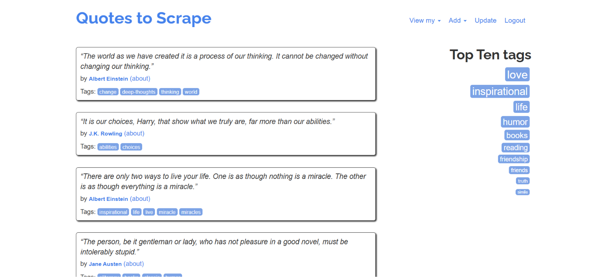
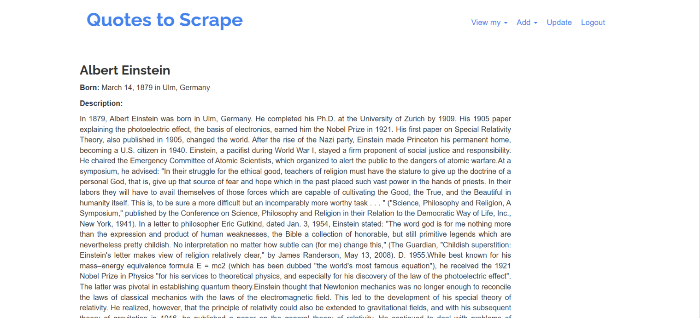
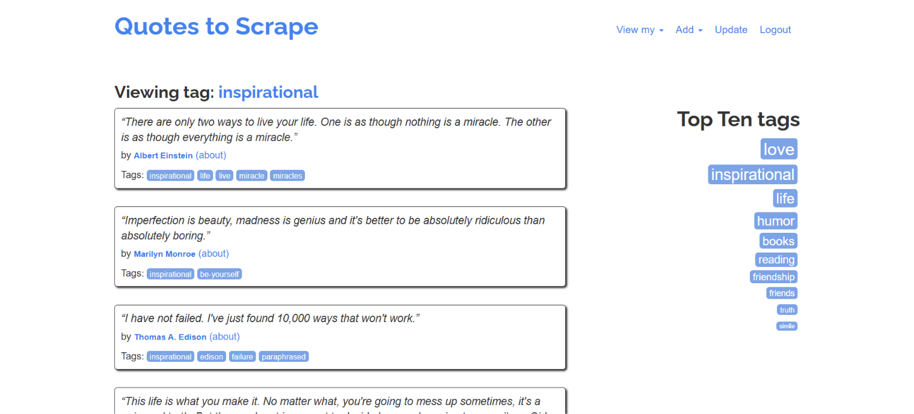
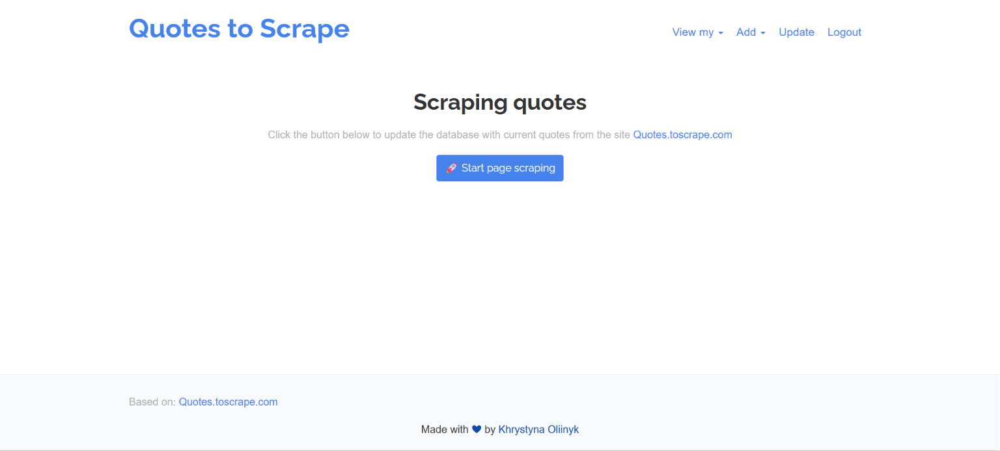

# 🌐 Multi-Database Django Web Platform & Data Migration Pipeline

Веб-платформа — аналог [quotes.toscrape.com](https://quotes.toscrape.com), побудована на Django з повним циклом роботи з даними: від скрапінгу до міграції між базами даних.

---

## 📌 Про проєкт

Проєкт демонструє повний pipeline роботи з даними:

1. **Scrapy** збирає цитати та авторів з [quotes.toscrape.com](https://quotes.toscrape.com) у файли `quotes.json` та `authors.json`
2. Дані завантажуються у хмарну базу **MongoDB Atlas** через **MongoEngine ODM**
3. Django-додаток підключений до **PostgreSQL** (через Docker)
4. Кастомний **management command** мігрує дані з MongoDB у PostgreSQL
5. На сайті реалізована кнопка **UPDATE** — пряме оновлення PostgreSQL через **BeautifulSoup** парсинг оригінального сайту

---

## 🛠 Технологічний стек

| Категорія | Технології |
|---|---|
| Backend | Python 3.13, Django 6.0 |
| Scraping | Scrapy, BeautifulSoup, Requests |
| Databases | PostgreSQL, MongoDB Atlas |
| ORM / ODM | Django ORM, MongoEngine |
| DevOps | Docker, Docker Compose |
| Інше | python-dotenv, Poetry |

---

## ✨ Функціонал

### Доступно без реєстрації
- Перегляд усіх цитат з пагінацією (кнопки next / previous + вибір сторінки)
- Перегляд сторінки кожного автора
- Пошук цитат за тегами (клік на тег → список цитат)
- Блок **Top Ten Tags** — найпопулярніші теги

### Тільки для зареєстрованих користувачів
- Додавання нових авторів, цитат, тегів
- Перегляд власних авторів, цитат та тегів на окремих вкладках
- Видалення власних записів (при видаленні автора — автоматично видаляються його цитати)
- Кнопка **UPDATE** — скрапінг даних з оригінального сайту та наповнення/оновлення бази даних

---

## 🗂 Структура проєкту

```
django-scrapy-data_migration/
├── mysite/                        # Django додаток
│   ├── mysite/                    # Налаштування проєкту
│   ├── quoteapp/                  # Основний застосунок
│   │   ├── management/commands/
│   │   │   └── migrate_mongo.py   # Міграція MongoDB → PostgreSQL
│   │   ├── parser.py              # BeautifulSoup парсер (кнопка UPDATE)
│   │   ├── models.py
│   │   ├── views.py
│   │   └── templates/
│   └── users/                      # Реєстрація та автентифікація
│       ├── models.py
│       ├── views.py
│       └── templates/                  
├── scrapy_scraper/                # Scrapy павук
│   └── quote_spyder/
│       ├── spiders/
│       │   └── quotes_spider.py   
│       ├── db_config.py
│       ├── main.py                # Збір даних з quotes.toscrape.com
│       ├── models.py 
│       └── seed.py
├── docker-compose.yml
├── .env.example
└── pyproject.toml
```

---

## 🚀 Як запустити

### 1. Клонуй репозиторій
```bash
git clone https://github.com/Khrystyna979/django-scrapy-data_migration.git
cd django-scrapy-data_migration
```

### 2. Створи `.env` файл
```bash
cp .env.example .env
```
Заповни значення у `.env` (дивись `.env.example`)

### 3. Запусти PostgreSQL через Docker
```bash
docker-compose up -d
```

### 4. Встанови залежності
```bash
pip install poetry
poetry install
```

### 5. Виконай міграції Django
```bash
cd mysite
python manage.py migrate
```

### 6. Створи суперкористувача
```bash
python manage.py createsuperuser
```

### 7. (Опційно) Мігруй дані з MongoDB у PostgreSQL
```bash
python manage.py migrate_mongo
```

### 8. Запусти сервер
```bash
python manage.py runserver
```

Відкрий у браузері: [http://localhost:8000](http://localhost:8000)

---

### Scrapy скрапер (окремо)
```bash
cd scrapy_scraper/quote_spyder
python main.py
```

---

## 📸 Скріншоти

 
 
 


---

## 👩‍💻 Автор

**Oliinyk Khrystyna** — [GitHub](https://github.com/Khrystyna979) | [LinkedIn](https://www.linkedin.com/in/khrystyna-oliinyk-200110376)
